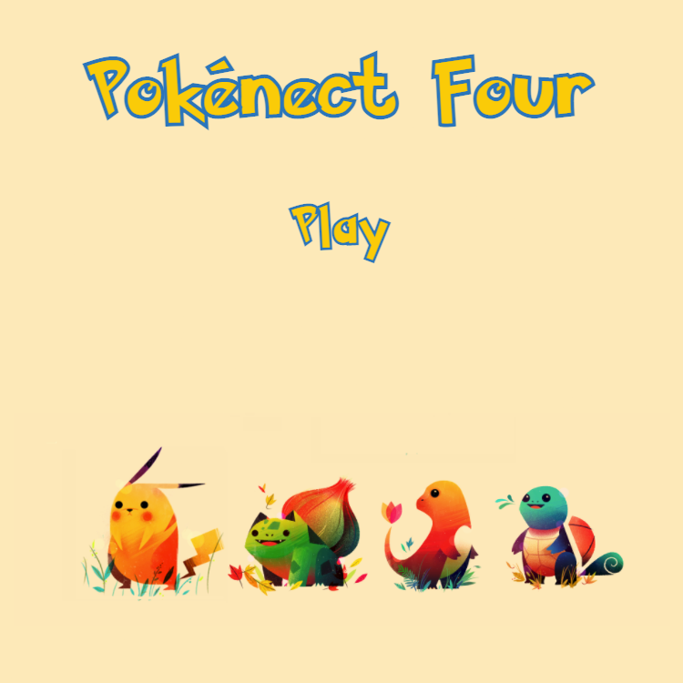
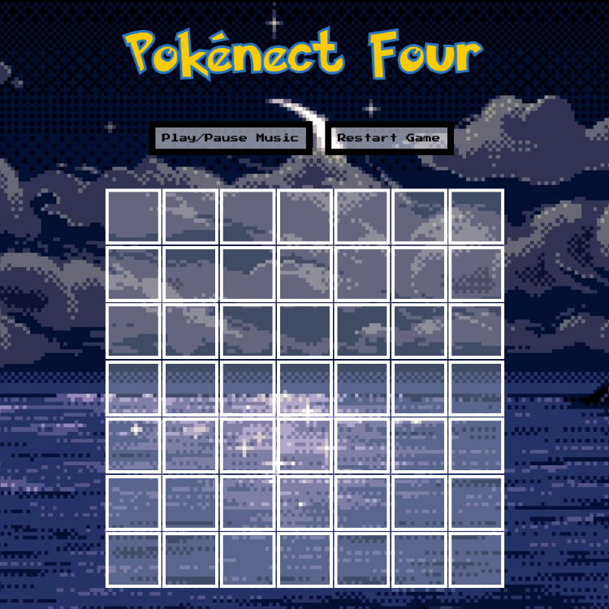
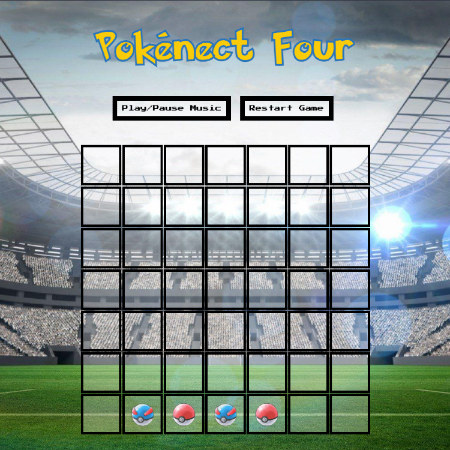

Pokénect Four
-------------

You've played Connect Four before. In fact, you've probably played it **a lot** if a) you're a parent or b) you are a software engineer. However, in my attempt to make games my son (6) would enjoy playing, I thought, "What would be a fun take on Connect Four?" It didn't take long for me to realize this would be a good choice, not only in theme, but also the pun.

I'm proud of myself for that one, not going to lie.

Rules
------

Pretty simple: first player to get four in a row (horizontally, vertically, or diagonally) wins! To play your piece, make sure to click on one of the squares in the top row. That's it!

Generic Disclaimer
-----

I don't own or have any association with Pokémon, nor did I compose any of the music or draw any of the artwork used here. Please don't sue me, Nintendo. I can't afford it.

Thank you
-----

I wanted to give a special thank you to: Phil B., Dane L., Jesse B., Stephanie M., Jack H., and Peter N. for testing this project and offering much-appreciated feedback. This one was a bit of a stretch for me; the game logic really had me feeling defeated in the end. However, after taking all of your suggestions and encouragement to heart, I feel as if I am a much better developer through this process. I can't express enough how much I appreciate y'all.

